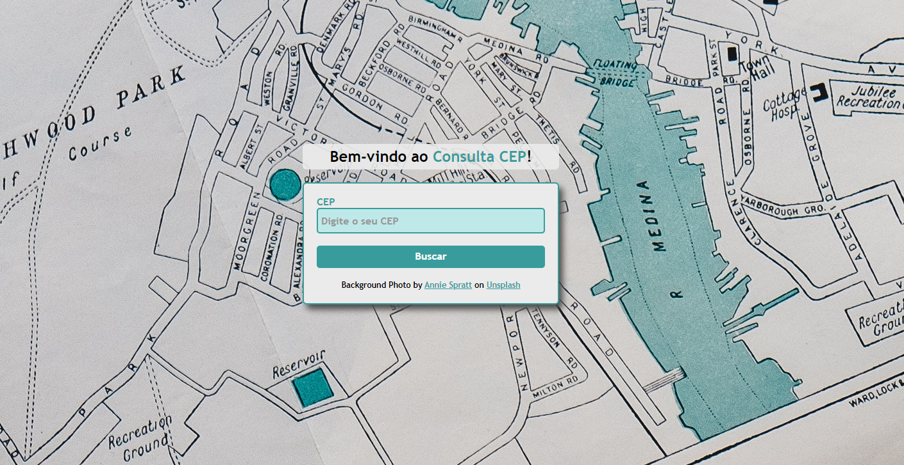

# Projeto Consulta CEP - Com API ViaCEP

## Olá, tudo certo? 

Obrigado por estar verificando meu projeto!

Este website foi feito com o intuito de buscar CEPs puxando os dados da API via JavaScript, e mostrando os dados
ao usuário.

Feito basicamente com:
- HTML5
- CSS3
- JavaScript

Você pode encontrar meus outros projetos navegando pelos repositórios, por enquanto há apenas projetos Front End, mas 
em breve entrarão também de Back End. Valeu!
